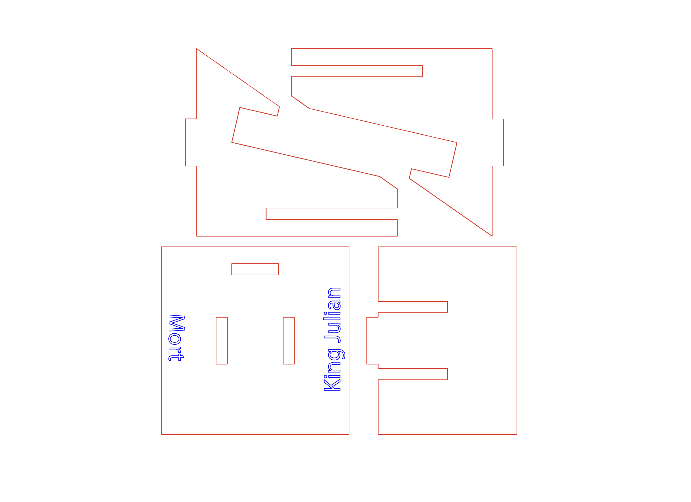

# Project 1 Computational Design (Week 2 of 08.31.2023) :bowtie:

## 💭 Reflections

- This week, I learned how to operate Rhino and Grasshopper on a beginner level.
  
- Explored what Rhino and Grasshopper can be used for such as architecture and computational design.
  
- How to utilize a laser cut machine on my own for the first time.
  
- Learned that the thickness, and material types of the wood board I’m cutting were also important.
  
- Combined everything from Rhino, Grasshopper, Illustrator to Laser Cutting enabled to see how design is seen from a macro level where everything is connected.

## 🔎 Speculations
- I recently learned about computational design and the tools for it are Rhino and Grasshopper. I think with AI emerging, it might be able to make the process of computing data into products that will be more user-friendly. The designs that were generated from Rhino and Grasshopper so far from our project seem to me that the designs it generated had a lot of limits to the users.

- I think it would also be cool if we could do all of this in VR instead of having multiple desktops and windows opened. Modeling in VR is becoming a common thing so maybe when we’re traveling and still want to work in Rhino and Grasshopper, all we need is the VR device.

I read that:
>*“Grasshopper helps define the relationship between the model and its components, making it easy to manipulate and generate explorative forms that have a multi-dimensional functionality”*

And the plugin [grasshopper] and its intuitive way...
> *”...can develop a design is helping many designers to experiment with thought-provoking geometries which earlier weren’t possible”.*

I could see how this will be or already is being used to create architectures, products, and designs that are sustainability-focused. With the climate becoming extreme, there are already research and ongoing projects that utilize all of the software I used this week to [conceptual structural design for assessing the embodied environmental impact](https://www.mdpi.com/2071-1050/15/15/11990).

- In regard to laser cutting, I suspect maybe we'll use more bamboo in laser cutting for sustainability.

## 💻 Images & Videos

1. Adjusted prism depth to get rid of the stop on top so that the phone can be vertical. 
2. After talking to my peers who have printed their phone stand mode, I heard that their phone stand was a bit wonky and unstable when assambled together. As a result, I measured the material's thickness which was 0.210in. Then convert that to 5-6 millimeters to enter in rhino (since its metric system uses mm).
3. Entered 6 millimeters for the "materials thickness"

###  :trollface: ❗ Final Product

## ✏️ Sketches, Drawings and Diagrams
I think what I would change about this if I had more time is the decreasing material thickness from 6mm to 5mm since my phone stand is still slightly loose when assembled together.

I made this iteration sketch so that there's more gap for phones with big cases like mine. A bigger gap where the phone sits will also make it easier to adjust different angles.

