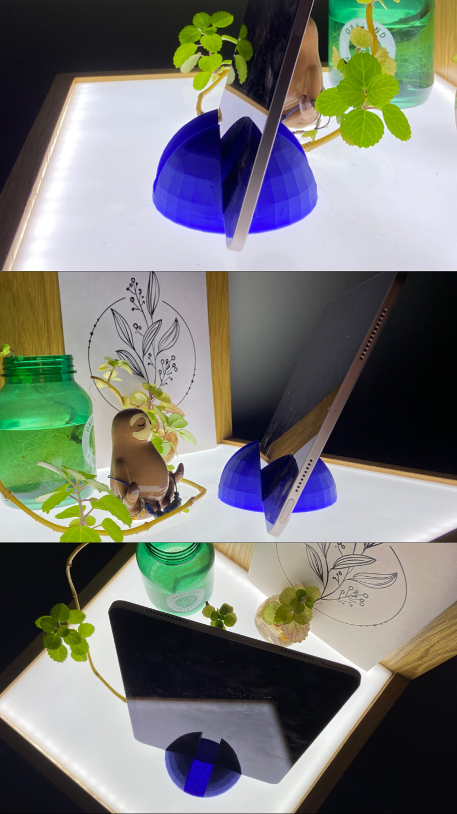

# Computational Design: Learning Grasshopper in 5 Days and I Got a Phone Case??!!

## Goals for :paw_prints:**Platypus Level**:paw_prints:
1. Personalization: Modify the baseline grasshopper+rhino file to include my own geometric design.
2. Must demonstrate an understanding of how to rewire the grasshopper [file] to meet these requirements. 
3. Consider the various grasshopper operations involved in a procedural, generative model (boolean operations, subtractions, offsets, etc). The result will be a custom design system.
4. The result is something relevant to my life.

## Ideate/sketching
- My need was to create a multifunctional phone stand--would either be versatile enough for various devices to fit or hold multiple devices at once.
- I started doing some sketches for my needs to create a personalized stand that can hold a phone and an iPad.

Here are some of the sketches: 

	

 I decided to go with this final sketch:

 	

## Exploring the tools

Since I wasn't at all familiar with Rhino or Grasshopper five days ago yet. I asked for advice on how to get started and received this feedback:
1. Replicate rhino 3D geometry with some parametric
2. Import 3D model directly into Grasshopper
3. Go into the simplified phone stand and try to replace the geometry

I began doing some exercises to familiarize myself with the Rhino interface, modeling tools, and generative features of Grasshopper.

### 1. Replicate rhino 3D geometry with some parametric:
I began this by watching a [YouTube tutorial on how to model a water bottle](https://www.youtube.com/watch?v=pq8N4ENULIg) in Rhino. The water bottle took me 30 minutes but the phone stand took me about 2-3 hours.

 
After the water model, I then modeled one of the phone stands from my ideation sketch.

 

### 2. Import 3d model directly into Grasshopper:
- After I did some modeling exercises, I learned that I could combine my model in Rhino with Grasshopper and then generate something by importing Rhino model into Grasshopper (which I didn't know prior to that). I imported the model as brep into Grasshopper.

### 3. Go into the simplified phone stand and try to replace the geometry:
- So now that I have done the two things above. I still had trouble combining both the Rhino model AND Grasshopper.
- As a result, I went back to watch TJ's video and manipulate or replace the geometry in the [given file](https://github.com/Berkeley-MDes/desinv-202/releases):

On the left is a picture of the before I replace the geometry and on the right is a picture of after I replace the sphere with a cube (The cube picture doesn't look anything like a phone stand but the idea was to understand this system that was created in grasshopper and change the shape of the original phone stand).

## Putting it all together!

Ok so now that I did all of the above…I was still confused LOL. But I started modeling from Grasshopper this time instead of modeling in Rhino first. And what I ended up getting in Grasshopper is shown below:

- Of course, there were a lot of iterations and changes to get here but I won't show you all that mess. But the 3 things I want to show in this model are its ability to hold a phone or an iPad. There's a cross on the phone holder (which you can see in the end result pic). The gap in the x-direction is smaller than the gap in the z-direction. This will allow the phone to either stand vertically when placed in the x-direction gap or slant upward when placed in the z-direction.

## :clapper: Capturing the process: 
- [Click here to watch the video](https://studio.youtube.com/video/DPourzR-N2M/edit)

## THE RESULT:
- Here's the final product...

## Reflection and challenges:
- Overall, it was a semi-intense project in trying to use Grasshopper and Rhino but very enjoyable.
- A few things I struggled with were 1)creating something from scratch in Grasshopper, and 2) replicating the model to look like what I initially envisioned in my sketches.
- Through this project, I understood the many ways to use Rhino and Grasshopper more. I see the usefulness and benefits of generative design more and I hope to continue doing more projects in Rhino and Grasshopper.

## Speculation:
- I see generative design is already and will continue to expand even more. I see so many ways generative design can be used besides just the architectural discipline.
- I was inspired by [Cody Glen's project](https://www.codyglen.com/) on how he utilized generative design to reuse old/thrown-away wooden materials to create something new. I'm very interested in seeing how this way of design--generating a way to solve waste or turn it into something new--grows in the future. I'm also very curious to learn how I would be able to do a similar project like Cody's.

